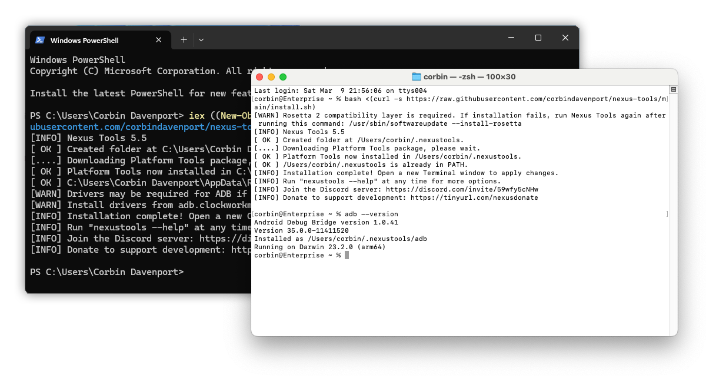

# Nexus Tools

Nexus Tools is an installer and updater for [Android SDK Platform Tools](https://developer.android.com/studio/releases/platform-tools), which includes [ADB](https://developer.android.com/studio/command-line/adb.html), Fastboot, and other applications. Nexus Tools is writen in Dart, and can run on Linux, macOS, Windows, and Chrome OS.

Nexus Tools downloads the latest Platform tools package directly from Google's servers, so you're always getting the latest version. The tools are installed to `~/.nexustools` (`%AppData%\NexusTools` on Windows), and adds the directory to your system's path. On Windows, Nexus Tools can optionally install [Koush's Universal ADB Driver](https://github.com/koush/UniversalAdbDriver). The SDK Platform Tools can be updated by running `nexustools -i`, or you can uninstall everything by running `nexustools -r`.



## How to use on Linux, macOS, and Chrome OS

Paste this command into your Terminal app:

```
bash <(curl -s https://raw.githubusercontent.com/corbindavenport/nexus-tools/main/install.sh)
```

You can also download the Mac and Linux versions from the [latest release page](https://github.com/corbindavenport/nexus-tools/releases/), un-zip the file, and run it from the Terminal.

## How to use on Windows

Open Windows PowerShell from the Start Menu and paste this command:

```
iex ((New-Object System.Net.WebClient).DownloadString('https://raw.githubusercontent.com/corbindavenport/nexus-tools/main/install.ps1'))
```

You can also download the Windows version from the [latest release page](https://github.com/corbindavenport/nexus-tools/releases/), un-zip the file, and run it from Windows PowerShell or the Command Prompt.

## Privacy & Analytics

Nexus Tools uses [Plausible Analytics](https://plausible.io) to transmit your operating system and CPU architecture during the installation process for development purposes. You can disable analytics reporting by adding the `--no-analytics` parameter to the install command, like this:

```
bash <(curl -s https://raw.githubusercontent.com/corbindavenport/nexus-tools/main/install.sh) --no-analytics
```

It also works when running Nexus Tools locally:

```
nexustools --no-analytics
```

---

Nexus Tools has been featured on [MakeUseOf](https://www.makeuseof.com/how-to-unlock-android-device-bootloader), [XDA](https://www.xda-developers.com/set-up-adb-and-fastboot-on-linux-mac-os-x-and-chrome-os-with-a-single-command/), [Android Police](https://www.androidpolice.com/install-and-use-adb-on-windows-mac-linux-android-chromebooks-browser/), [9to5Google](https://9to5google.com/2021/12/02/how-to-downgrade-from-android-12-to-android-11-on-google-pixel/#:~:text=Nexus%20Tools), [Wccftech](https://wccftech.com/set-android-adb-fastboot-mac-os/), [Redmond Pie](https://www.redmondpie.com/how-to-install-android-5.0-lollipop-on-nexus-5-using-mac-the-easy-way/), and other places.
